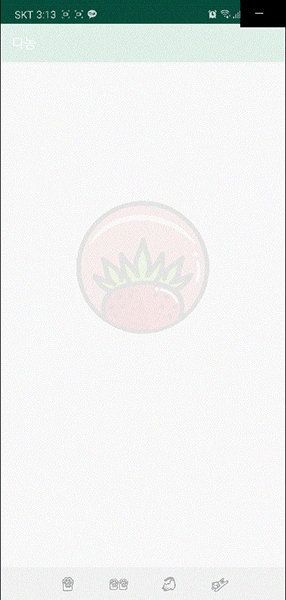
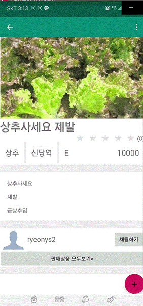
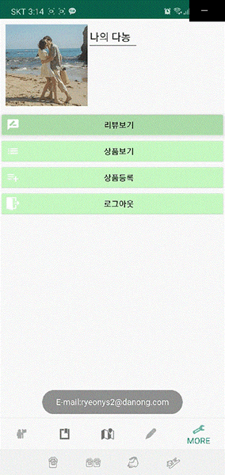

# 다농[농산물 정보 플랫폼]
## Firebase를 사용해서 Google Map, chat, notice 등 구현한 android App
##### #FirebaseAuth #Firestore 'RealtimeDatabase #Recyclerview
### 찾고 싶은 농산물의 이름을 검색하세요
#### 지도에서 상품을 클릭해보세요

### 농산물의 상세정보를 확인할 수 있어요
#### 생산자나 상품에 대한 리뷰를 남겨보세요

### 생산자와 실시간 채팅을 해보세요
#### 채팅 중인 목록을 확인 하세요

### 농사 TIP이나 공유하고 싶은 내용을 게시글에 남겨보세요
#### 실시간으로 글을 등록하고 수정, 삭제 할 수 있어요

### 마이페이지에서 내가 등록한 상품과 리뷰를 확인해보세요
#### 상품을 바로 등록할 수 있어요

